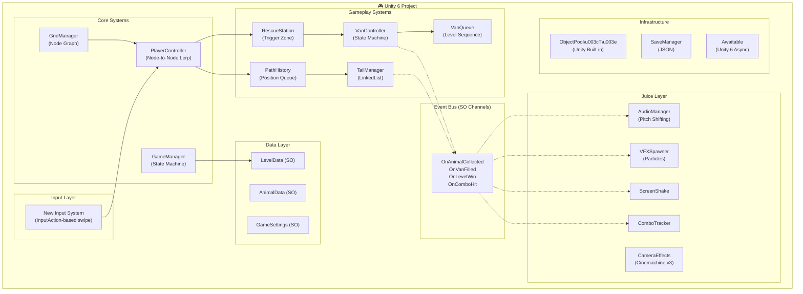
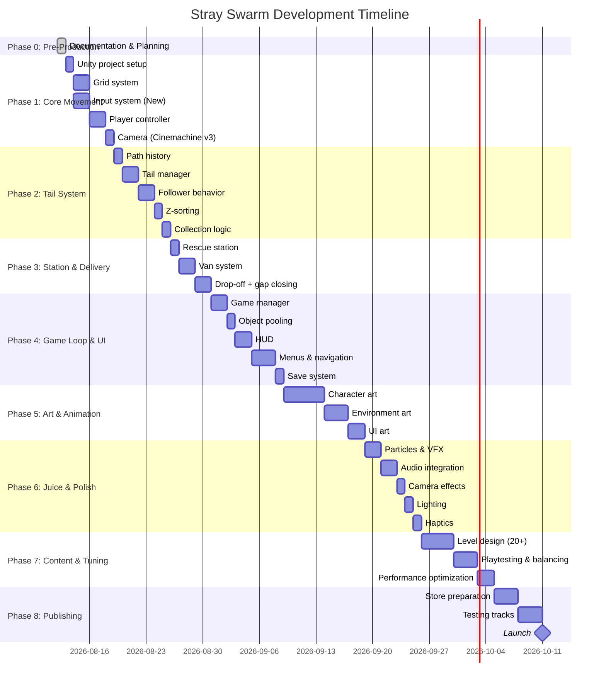
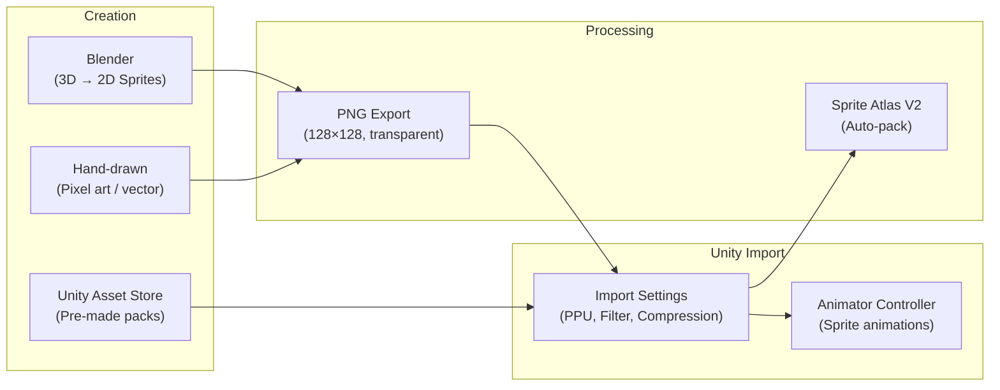

# 🗺️ Stray Swarm — Final Comprehensive Overview Plan

> **The Single Source of Truth** — This document is the 30,000-foot view of the entire project.
> It ties together all documentation, phases, systems, and the complete roadmap from empty folder to Play Store launch.
>
> **Last Updated:** 2026-08-12 · **Status:** Pre-Production

---

## 📌 Project Summary

| Detail | Value |
|---|---|
| **Game** | Stray Swarm |
| **Engine** | Unity 6 (6000.x) — 2D URP |
| **Platform** | Android (Google Play) + iOS (App Store) |
| **Genre** | Hypercasual / Puzzle-Flow |
| **Team** | Solo developer + AI assistant (full team) |
| **Art Pipeline** | Blender (3D→2D rendering) + Unity Asset Store + Hand-drawn |
| **Target** | Stable 60 FPS on mid-range mobile devices |
| **Est. Dev Time** | 8-12 weeks to v1.0 |

---

## 🎮 Game In One Sentence

*Swipe to navigate a stray cat through city mazes, collect colorful lost animals into a conga line, and deliver them to matching rescue vans before time runs out.*

---

## 🏛️ Architecture At A Glance



---

## 🛠️ Technology Stack (Unity 6 — 2026 Current)

| Technology | Package | Status | Notes |
|---|---|---|---|
| **Rendering** | URP 2D Renderer | ✅ Current | Light2D, Volume post-processing, 2D shadows |
| **Input** | New Input System | ✅ REQUIRED | Old `Input.GetKey` is **deprecated**. Use `InputAction` |
| **Camera** | Cinemachine v3 | ✅ Current | `CinemachineCamera` (was `CinemachineVirtualCamera`) |
| **Text** | TextMeshPro (UGUI) | ✅ Built-in | Part of `com.unity.ugui`. No separate package needed |
| **Object Pooling** | `UnityEngine.Pool` | ✅ Built-in | `ObjectPool<T>` — replaces custom pooling scripts |
| **Async/Await** | `Awaitable` | ✅ Built-in | `Awaitable.WaitForSecondsAsync()` — modern alternative to coroutines |
| **Tiles** | 2D Tilemap + Extras | ✅ Current | Rule Tiles for smart auto-tiling |
| **Sprites** | Sprite Atlas V2 | ✅ Current | Folder-based packing, platform overrides |
| **Animation** | DOTween (3rd party) | ✅ Compatible | v1.3.030+ for Unity 6. Run setup wizard after import |
| **Profiling** | Unity Profiler + Frame Debugger | ✅ Built-in | Profile on real devices, not editor |

> [!CAUTION]
> **DO NOT USE deprecated systems:** `Input.GetKeyDown()`, `UnityEngine.UI.Text`, `CinemachineVirtualCamera` (old name), `WWW`, custom object pool scripts, `PlayerPrefs` for game progress.

---

## 📊 Complete Feature Matrix

### Core Features (v1.0 — Must Ship)

| Feature | System | Priority | Phase |
|---|---|---|---|
| Grid-based node movement | GridManager + PlayerController | P0 | 1 |
| 4-directional swipe input | InputHandler (New Input System) | P0 | 1 |
| Input buffering | InputHandler | P0 | 1 |
| No 180° turns | PlayerController | P0 | 1 |
| Camera smooth follow | Cinemachine v3 2D | P0 | 1 |
| Conga line / tail following | TailManager + PathHistory | P0 | 2 |
| Animal collection | TailManager | P0 | 2 |
| Self-crossing (no penalty) | DynamicDepthSort | P0 | 2 |
| 6 animal types (by color) | AnimalData ScriptableObjects | P0 | 2 |
| Rescue station drop-off | RescueStation | P0 | 3 |
| Van system (color + capacity) | VanController + VanQueue | P0 | 3 |
| Gap-closing dash | TailManager | P0 | 3 |
| Level timer | GameManager | P0 | 4 |
| 3-star rating system | GameManager | P0 | 4 |
| Win/loss conditions | GameManager | P0 | 4 |
| Level data (ScriptableObject) | LevelData | P0 | 4 |
| HUD (timer, van queue, combo) | UI Controllers | P0 | 4 |
| Main menu | MainMenuController | P0 | 4 |
| Level select | LevelSelectController | P0 | 4 |
| Results screen | ResultsScreen | P0 | 4 |
| Save/load (stars, progress) | SaveManager (JSON) | P0 | 4 |
| Object pooling | ObjectPool\<T\> (built-in) | P0 | 4 |
| Character art + animations | Sprites + Animator | P1 | 5 |
| Environment tilemap art | Tilemap assets | P1 | 5 |
| UI art (buttons, panels, icons) | Sprite assets | P1 | 5 |
| DOTween juice animations | Juice Layer | P1 | 6 |
| Particle effects (10+ types) | VFXSpawner | P1 | 6 |
| SFX + pitch-shifting audio | AudioManager | P1 | 6 |
| Background music (2 layers) | AudioManager | P1 | 6 |
| Screen shake | ScreenShake | P1 | 6 |
| URP 2D lighting | Light2D setup | P1 | 6 |
| Haptic feedback (mobile) | HapticManager | P1 | 6 |
| Combo system | ComboTracker | P1 | 6 |
| 20+ levels | LevelData assets | P1 | 7 |
| Scene transitions | TransitionManager | P1 | 4 |
| Settings (audio, vibration) | SettingsUI + SaveManager | P1 | 4 |

### Future Features (Post v1.0)

| Feature | Version | Impact | Effort |
|---|---|---|---|
| Power-ups (speed, magnet, freeze) | v1.1 | ⭐⭐⭐⭐ | ⭐⭐ |
| Wildcard rainbow animal | v1.1 | ⭐⭐⭐ | ⭐ |
| Dynamic van patience timer | v1.2 | ⭐⭐⭐⭐ | ⭐⭐ |
| Hazards (moving cars, puddles) | v1.2 | ⭐⭐⭐⭐ | ⭐⭐⭐ |
| Daily challenges | v1.3 | ⭐⭐⭐⭐ | ⭐⭐⭐ |
| World themes (Beach, Night) | v2.0 | ⭐⭐⭐⭐⭐ | ⭐⭐⭐⭐ |
| Player skins / customization | v2.0 | ⭐⭐⭐⭐ | ⭐⭐⭐ |
| Leaderboards (Play Games) | v2.0 | ⭐⭐⭐ | ⭐⭐ |
| Achievements | v2.0 | ⭐⭐⭐ | ⭐⭐ |
| Level editor + sharing | v3.0 | ⭐⭐⭐⭐⭐ | ⭐⭐⭐⭐⭐ |
| Multiplayer race mode | v3.0+ | ⭐⭐⭐⭐⭐ | ⭐⭐⭐⭐⭐ |
| Monetization (ads, IAP) | v1.1+ | ⭐⭐⭐ | ⭐⭐ |

---

## 📅 Development Roadmap



---

## 📝 Documentation Index

| # | Document | Size | Purpose |
|---|---|---|---|
| — | [README.md](file:///d:/Antigravity%20Projects/Stray%20Swarm/README.md) | 4 KB | Project overview & quick start |
| 01 | [Game Design Document](file:///d:/Antigravity%20Projects/Stray%20Swarm/Docs/01_GAME_DESIGN_DOCUMENT.md) | 15 KB | Every mechanic, rule, and design decision |
| 02 | [Technical Architecture](file:///d:/Antigravity%20Projects/Stray%20Swarm/Docs/02_TECHNICAL_ARCHITECTURE.md) | 15 KB | Code architecture, systems, APIs |
| 03 | [Art Bible](file:///d:/Antigravity%20Projects/Stray%20Swarm/Docs/03_ART_BIBLE.md) | 16 KB | Visual style, Blender pipeline, Asset Store guide |
| 04 | [Audio Bible](file:///d:/Antigravity%20Projects/Stray%20Swarm/Docs/04_AUDIO_BIBLE.md) | 12 KB | Sound design, music, SFX specs |
| 05 | [Game Juice Bible](file:///d:/Antigravity%20Projects/Stray%20Swarm/Docs/05_GAME_JUICE_BIBLE.md) | 11 KB | Animations, particles, camera, URP post-processing |
| 06 | [Level Design Guide](file:///d:/Antigravity%20Projects/Stray%20Swarm/Docs/06_LEVEL_DESIGN_GUIDE.md) | 14 KB | How to create great levels |
| 07 | [Asset Tracker](file:///d:/Antigravity%20Projects/Stray%20Swarm/Docs/07_ASSET_TRACKER.md) | 13 KB | Every asset with status tracking |
| 08 | [Publishing Guide](file:///d:/Antigravity%20Projects/Stray%20Swarm/Docs/08_PUBLISHING_GUIDE.md) | 10 KB | Play Store + App Store process |
| 09 | [Tips & Tricks](file:///d:/Antigravity%20Projects/Stray%20Swarm/Docs/09_TIPS_AND_TRICKS.md) | 18 KB | Unity 6 best practices, performance, workflow |
| 10 | [Ideas Backlog](file:///d:/Antigravity%20Projects/Stray%20Swarm/Docs/10_IDEAS_BACKLOG.md) | 14 KB | Future features ranked by impact/effort |
| — | [AI Agent Instructions](file:///d:/Antigravity%20Projects/Stray%20Swarm/Docs/AI_AGENT_INSTRUCTIONS.md) | 12 KB | How the AI guides you through development |
| — | [TODO](file:///d:/Antigravity%20Projects/Stray%20Swarm/Docs/TODO.md) | 12 KB | Master task tracker (150+ tasks) |
| — | [Changelog](file:///d:/Antigravity%20Projects/Stray%20Swarm/Docs/CHANGELOG.md) | 2 KB | Version history |
| — | **This Document** | — | Final comprehensive overview |

---

## 🎨 Asset Pipeline Overview

### How We Create Assets



### Blender Workflow (for characters)
1. Model character in Blender (low-poly, stylized)
2. Set up orthographic camera (top-down or isometric)
3. Apply flat/toon shading matching our Art Bible palette
4. Render frames for each animation (idle, walk, dash, etc.)
5. Export as PNG spritesheet with transparency
6. Import into Unity, configure Sprite Editor for slicing
7. Create Animator Controller with animation clips

### Unity Asset Store Workflow
1. Search for "2D top-down" or "2D casual" packs
2. Check license: must allow commercial use
3. Download and import into `Assets/Plugins/` or `Assets/_StraySwarm/Art/`
4. Adapt to match our palette (color tinting, outline overlay)
5. Ensure consistent resolution and PPU with existing assets

---

## ⚡ Performance Budget

| Metric | Target | Red Line |
|---|---|---|
| Frame Rate | 60 FPS stable | Below 50 FPS |
| Draw Calls | < 50 per frame | Above 80 |
| Particles on Screen | < 200 | Above 300 |
| Memory (Runtime) | < 200 MB | Above 350 MB |
| APK Size | < 80 MB | Above 150 MB |
| Battery Drain | < 10%/hour gameplay | Above 15%/hour |
| Load Time (level) | < 1 second | Above 3 seconds |

### Performance Optimization Strategy

| Optimization | How | When |
|---|---|---|
| **Object Pooling** | `UnityEngine.Pool.ObjectPool<T>` for animals, VFX, UI | Phase 4 |
| **Sprite Atlasing** | Sprite Atlas V2, max 2048×2048 per atlas | Phase 5 |
| **Texture Compression** | ASTC 6×6 (Android), ASTC 4×4 (iOS) | Phase 7 |
| **Zero-alloc Update** | No `new`, LINQ, string concat in Update/FixedUpdate | Always |
| **Reference Caching** | Cache Camera, components in Awake(). Never use Find in loops | Always |
| **Batching** | Static batch environment, dynamic batch characters | Phase 5 |
| **Particle Budget** | Max 200 on screen. Pool and reuse particle instances | Phase 6 |
| **Audio Compression** | OGG Vorbis. SFX: Decompress on Load. Music: Streaming | Phase 6 |
| **Profile on Device** | Unity Profiler connected to real Android/iOS device | Weekly from Phase 4 |

---

## 🎯 Modularity & Extensibility Design

### How Every System Stays Independent

```
┌─────────────────────────────────────────────────────┐
│                  GAME EVENT BUS                      │
│          (ScriptableObject Channels)                 │
│                                                      │
│  OnAnimalCollected  OnVanFilled  OnLevelWin  ...    │
└──────┬─────────────────┬──────────────────┬──────────┘
       │                 │                  │
       ▼                 ▼                  ▼
┌──────────┐     ┌──────────┐      ┌──────────┐
│ Audio    │     │  VFX     │      │  UI      │
│ Manager  │     │ Spawner  │      │ Manager  │
│          │     │          │      │          │
│ Listens  │     │ Listens  │      │ Listens  │
│ to events│     │ to events│      │ to events│
│          │     │          │      │          │
│ Plays    │     │ Spawns   │      │ Updates  │
│ sounds   │     │ particles│      │ display  │
└──────────┘     └──────────┘      └──────────┘

Each system:
✅ Only knows about the Event Bus
✅ Can be deleted without breaking anything else
✅ Can be replaced with a different implementation
✅ Can be reused in a completely different game
❌ Does NOT reference any other manager directly
```

### Adding New Features Without Breaking Existing Code

| Want to Add... | What You Create | What You Modify |
|---|---|---|
| New animal type | New `AnimalData` SO asset | Nothing (data-driven) |
| New level | New `LevelData` SO asset | Nothing (data-driven) |
| Power-up system | New `PowerUpManager.cs` + `PowerUpData.cs` + event listener | Nothing |
| New particle effect | New VFX prefab + event listener | Nothing |
| Wildcard animal | Small tweak to `TailManager.TryDeliverToVan()` | 1 line change |
| Hazards | New `HazardManager.cs` + `HazardData.cs` | Nothing |
| New world theme | New tilemap art + palette swap | Nothing (art only) |
| Monetization (ads) | New `AdManager.cs` + event listener | Nothing |
| Leaderboards | New `LeaderboardManager.cs` | Nothing |

---

## 🧪 Testing Strategy

### Automated
- **Unit Tests:** GridManager (node connectivity), TailManager (add/remove/match), VanQueue (sequencing)
- **Integration Tests:** Full level simulation (spawn → collect → deliver → win)
- **Run with:** Unity Test Framework (`com.unity.test-framework`)

### Manual (Every Phase)
- [ ] Swipe responsiveness on real device
- [ ] Frame rate check (Profiler on device)
- [ ] All levels completable
- [ ] No crashes on transitions
- [ ] Save/load persists correctly
- [ ] Audio plays correctly
- [ ] Particles look good on device (not too many/few)

### Device Testing Matrix
| Device | OS | Resolution | Priority |
|---|---|---|---|
| Mid-range Android (e.g., Samsung A54) | Android 13+ | 1080×2400 | P0 |
| Low-end Android (e.g., Redmi Note 10) | Android 11+ | 1080×2340 | P0 |
| High-end Android (e.g., Pixel 8) | Android 14+ | 1080×2400 | P1 |
| iPhone 13 | iOS 16+ | 1170×2532 | P1 (if targeting iOS) |
| iPad (any) | iPadOS 16+ | 2048×2732 | P2 |

---

## 💡 Game Design Tips & Tricks

### Making It Addictive
1. **Variable Reward Schedule** — 3-star system creates replayability ("I got 2 stars, I NEED to get 3")
2. **Near-Miss Psychology** — Timer that often ends JUST after the player was about to win → instant retry urge
3. **Combo Escalation** — Pitch-shifting audio + visual escalation makes rapid collection feel incredible
4. **Bite-Sized Levels** — 30-60 second levels = perfect for mobile play sessions
5. **Progress Visibility** — Level select with stars creates a visible "mountain to climb"

### Making It Feel Great
1. **The 3-Channel Feedback Rule** — Every interaction must have: Visual (animation/particle) + Audio (SFX) + Haptic (vibration)
2. **Squash & Stretch Everything** — Characters, buttons, UI panels. Nothing should be rigid
3. **Overshoot Easing** — Use `OutBack` easing on UI elements for bouncy, playful feel
4. **Screen Shake = Impact** — Small shakes on van departure = power. Too much = annoying. Find the sweet spot
5. **Color-Matched Everything** — Collection VFX matches animal color. Confetti matches van color. It's satisfying subliminal design

### Avoiding Common Hypercasual Mistakes
1. ❌ Don't add lives/hearts — punishing retention mechanics kill casual players
2. ❌ Don't gate progress behind ads — optional rewarded ads only
3. ❌ Don't make tutorials verbose — show, don't tell. First 3 levels ARE the tutorial
4. ❌ Don't add too many mechanics at once — introduce one new element per 5 levels
5. ❌ Don't neglect the first 10 seconds — a new player decides to keep or delete within 10 seconds of opening

---

## 🚀 Launch Checklist (Phase 8 Preview)

### Before Submitting to Store
- [ ] All 20+ levels complete and playtested
- [ ] 60 FPS confirmed on mid-range devices
- [ ] Zero crashes in 30-minute play session
- [ ] APK < 100 MB (AAB format)
- [ ] Privacy policy page created (hosted URL)
- [ ] App icon (512×512 Play, 1024×1024 iOS)
- [ ] Store screenshots (5+ per device type)
- [ ] Feature graphic (1024×500 for Play Store)
- [ ] Store description with keywords (ASO optimized)
- [ ] Content rating completed (PEGI 3 / Everyone)
- [ ] Data safety form completed
- [ ] All deprecated API calls removed
- [ ] New Input System properly tested on both platforms
- [ ] Save system tested (fresh install, upgrade, reset)
- [ ] Settings persist (audio, vibration, progress)
- [ ] Notch/safe area tested on modern phones

---

## 🔮 Long-Term Vision

```
v1.0 — Core Game          v1.1-1.3 — Features         v2.0 — Content            v3.0+ — Social
┌──────────────┐          ┌──────────────┐          ┌──────────────┐          ┌──────────────┐
│ 20 levels    │   ──→    │ Power-ups    │   ──→    │ 50+ levels   │   ──→    │ Level editor │
│ 6 animals    │          │ Hazards      │          │ World themes │          │ Multiplayer  │
│ Core loop    │          │ Daily tasks  │          │ Player skins │          │ Story mode   │
│ Juice & feel │          │ Wildcard     │          │ Leaderboards │          │ Community    │
└──────────────┘          └──────────────┘          └──────────────┘          └──────────────┘
```

---

## 📋 Quick Reference: What to Do Next

When you're ready to start building, here's the exact first session:

### Session 1: Project Creation
1. Open Unity Hub → New Project → 2D URP template → name it "StraySwarm" → save in `d:\Antigravity Projects\Stray Swarm\UnityProject\`
2. Inside Unity, create the folder structure: `Assets/_StraySwarm/Scripts/`, `Scenes/`, `Prefabs/`, `Art/`, `Audio/`, `Data/`
3. Install New Input System: `Window → Package Manager → Input System` → Enable and restart
4. Import DOTween: Download from Asset Store → Import → Run Setup Wizard
5. Import TMP Essential Resources: `Window → TextMeshPro → Import TMP Essential Resources`
6. Set: `Edit → Project Settings → Player → Target Frame Rate = 60`
7. Set: `Edit → Project Settings → Editor → Asset Serialization → Force Text`
8. Initialize Git: `git init`, add `.gitignore`, first commit
9. **Checkpoint:** Empty Unity project running at 60 FPS with all packages installed ✅

I'll guide you through every single click, line by line. Just say "let's go!" 🚀

---

> *"The journey of a thousand levels begins with a single swipe."*
