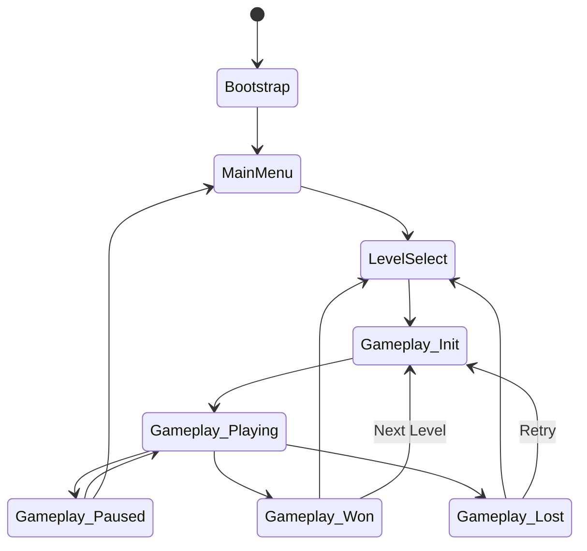

# 🐈 Stray Swarm — Game Design Document (GDD)

> [!NOTE]
> This is the definitive, living reference document for the development of "Stray Swarm." All features, mechanics, and design decisions must trace back to this document.

---

## 1. 🌟 Game Overview

**Stray Swarm** is a fast-paced, hypercasual puzzle-flow game where players control a street-smart stray cat navigating city grid mazes. The goal is to collect various lost and stray animals, forming a growing "conga line" (tail) behind the player, and deliver them to matching rescue vans before time runs out.

### At a Glance
| Element | Details |
| :--- | :--- |
| **Working Title** | Stray Swarm |
| **Genre** | Hypercasual / Puzzle-Flow / Arcade |
| **Platform** | Mobile (iOS & Android) |
| **Engine** | Unity 6 (2D Universal Render Pipeline) |
| **Target Audience** | Casual gamers, puzzle fans, ages 8-80 |
| **Monetization** | Rewarded Ads, IAP (Cosmetics), Remove Ads |
| **Visual Style** | 2D, rounded chunky shapes, thick outlines, oversized heads, pastel palette with bold accents. |
| **Camera** | Top-down 2D orthographic, dynamic tracking. |

### Elevator Pitch
*Snake* meets *Pac-Man* with a wholesome twist! Swipe to navigate a grid-based city as a stray cat, gathering a massive conga line of colorful lost animals. Drop them off at matching rescue vans in a race against the clock!

### Unique Selling Proposition (USP)
Unlike traditional *Snake*-like games, **self-crossing your tail carries no penalty**. The challenge lies in color-matching, path optimization, and managing the physical space of the grid while racing against a timer. The satisfying "gap-closing dash" mechanic when animals are deposited creates a highly kinetic, visually rewarding flow state.

---

## 2. 🏛️ Design Pillars

All design decisions must align with these four core pillars:

1. **🌊 Flow (Uninterrupted Kinetic Energy)**
   - The player should never stop moving unless interacting with a UI element.
   - Turns must feel snappy and responsive.
   - Input buffering ensures swiping feels magical, not frustrating.
2. **🧃 Juice (Maximum Satisfying Feedback)**
   - Every action—collecting an animal, depositing one, turning a corner—must have auditory and visual feedback.
   - Screen shake, particle explosions, pitch-bending sound effects.
3. **🎯 Simplicity (One-Finger Mastery)**
   - Controls are restricted to four-directional swipes.
   - Rules are immediately understandable within the first 10 seconds of play.
   - Visual clarity over intricate detail.
4. **💖 Charm (Wholesome Appeal)**
   - Animals must be cute, distinct, and instantly recognizable.
   - Positive reinforcement. The game is about *rescuing*, not fighting.
   - Idle animations and varied character designs inject personality into the grid.

---

## 3. 🐾 Player Character: The Stray Cat

### Personality & Identity
The player avatar is a street-smart, confident, but lovable stray cat. They are the "boss" of the alleys, taking it upon themselves to organize the chaotic lost animals of the city.

### Visual Design
- **Shape Language:** Triangular ears, round face, chunky body.
- **Color:** Contrast heavily with the environment and the collectible animals. Default: Charcoal Grey with a bright red bandana.
- **Animation States:**
  - `Idle`: Sitting, grooming, tapping paw.
  - `Run`: Energetic scamper, dust clouds at feet.
  - `Turn`: Sharp, lean-in sprite tilt when changing direction.
  - `Victory`: Happy jump, purring VFX.
  - `Defeat/Time Up`: Sad sit, drooping ears (never dead, just disappointed).

---

## 4. ⚙️ Core Mechanics (Detailed Specification)

### 4.1 Movement System
The movement is entirely grid-based, operating on a logical node system underlying the visual level design.

- **Constant Speed:** The player moves forward continuously at a set speed (tiles per second). There is no "stop" button.
- **Node-Based Grid:** The level consists of discrete grid cells. Turns can only happen exactly at the center of these cells (intersections).
- **Control Input:** 4-way swipe (Up, Down, Left, Right).
- **Input Buffering:**
  - A critical feature for perceived responsiveness.
  - If a player swipes *before* reaching an intersection, the input is stored (buffered) for a brief window (e.g., 0.25 seconds).
  - When the cat reaches the center of the next valid intersection, the buffered turn executes automatically.
- **No 180° Turns:** Swiping in the exact opposite direction of current travel does nothing. To reverse direction, the player must make two 90° turns (a U-turn).
- **Wall Collisions:** Hitting a wall stops the player until they swipe in an open direction.

### 4.2 The Conga Line (Tail) System
This is the heart of the gameplay loop.

- **Collection:** Moving over a stray animal adds it to the end of the tail.
- **Following Behavior:**
  - Animals do not use pathfinding. They use a strict **Path History System**.
  - The player object records its exact position and rotation at fixed intervals or grid transitions.
  - Follower N reads the position data from Follower N-1 (or the Player) delayed by exactly the distance of one grid unit.
- **No-Penalty Self-Crossing:**
  - The tail is *ethereal* to the player.
  - The player can walk right through their own conga line without failing the level.
  - This encourages chaotic, looping pathing and removes the primary frustration of traditional *Snake* games.
- **Maximum Length:** Levels can dictate a max tail length to prevent memory/performance issues, though the cap should be high enough (e.g., 50+) to allow for impressive swarms.

### 4.3 Stray Animals (Collectibles)
There are 6 distinct types of strays, each tied to a specific color and shape.

| Animal Type | Color | Shape Language | Movement Trait |
| :--- | :--- | :--- | :--- |
| **Puppy** | 🔵 Blue | Blocky / Square | Bouncy walk cycle |
| **Kitten** | 🌸 Pink | Triangular | Quick, darting steps |
| **Pigeon** | 🟡 Yellow | Round | Bobbing head, flutter |
| **Frog** | 🟢 Green | Squat / Wide | Hopping |
| **Hamster** | 🟠 Orange | Perfect Circle | Rolling / scurrying |
| **Bunny** | 🟣 Purple | Tall (Ears) | Long hops |

- **Spawn Behavior:** Strays spawn at predefined nodes. Some are static; others may wander a 1-tile radius before being collected.
- **Idle Animations:** When uncollected, they look around, sleep, or play to make the level feel alive.

### 4.4 Rescue Station & Van System
The destination for the conga line.

- **Single Station:** Each level has one central Rescue Station area, usually 2-3 lanes wide.
- **The Van Queue:** Vans drive up to the station and park.
- **Color Matching & Drop-off:**
  - Vans are colored to match specific animals.
  - The player must drive their conga line *through* the deposit zone of the van.
  - **Rule:** If the van is BLUE, only BLUE animals in the tail are removed as they pass over the drop-off point. Non-blue animals remain in the tail and pass through untouched.
- **Van States:**
  1. `Waiting`: Empty, doors open.
  2. `Filling`: Animals are entering; particle effects trigger.
  3. `Full`: Capacity reached. Doors close, happy honk SFX.
  4. `Departing`: Van drives off-screen, making room for the next queued van.

### 4.5 Gap-Closing Dash Mechanic
When animals in the *middle* of the tail are deposited, it leaves a physical gap in the conga line.

- **The Dash:** Instead of maintaining the gap, the animals behind the gap initiate a high-speed "dash" along the path history to catch up to the animal in front of them.
- **Visuals:** Motion blur trails, cartoon dust clouds, and a satisfying "zip" sound effect.
- **Purpose:** Keeps the tail visually cohesive, adds kinetic energy, and looks incredibly satisfying.

### 4.6 Combo System
To reward skilled pathing and risk-taking.

- **Trigger:** Collecting multiple animals in rapid succession (e.g., within 1.5 seconds of each other).
- **Audio Feedback:** Each consecutive collection increases the pitch of the collection SFX by a half-step (musical scale).
- **Milestone Rewards:**
  - **x3 Combo:** "Nice!" text pop-up, small score bonus.
  - **x5 Combo:** "Great!" text, trailing sparkles on the player.
  - **x10 Combo:** "Swarm!" text, screen flash, massive point bonus, time extension (+2 seconds).

---

## 5. 🏆 Win/Loss Conditions

The game is strictly timed, adding pressure to the puzzle-solving.

### Win Condition
- Successfully fill and dispatch all required vans for the level before the timer reaches 00:00.

### Loss Condition
- The timer reaches 00:00 before all required vans are dispatched.
- *Note:* There is no "death" by enemies or self-collision.

### Star Rating System
Completion grants 1 to 3 stars based on the remaining time upon level completion.

| Star Level | Requirement | Reward / Feedback |
| :--- | :--- | :--- |
| ⭐ 1 Star | Complete level with > 0s remaining | "Level Cleared!" |
| ⭐⭐ 2 Stars | Complete level with > 30% time remaining | "Great Job!" |
| ⭐⭐⭐ 3 Stars | Complete level with > 60% time remaining | "Perfect Rescue!" |

---

## 6. 🗺️ Progression System

- **Level Structure:** Levels are grouped into "Worlds" or "Districts" (e.g., 10-15 levels per district).
- **Star Gates:** Unlocking new districts requires a cumulative star count, encouraging replay of previous levels to optimize times.
- **World Themes:**
  1. **Downtown Alleys:** Simple grids, introduces basic mechanics, Dogs/Cats.
  2. **Central Park:** Organic grid shapes, water hazards (walls), introduces Pigeons/Frogs.
  3. **Neon District:** Conveyor belts (forced directional movement), introduces Hamsters/Bunnies.
  4. **Subway Station:** Teleportation tunnels, complex van queues.

---

## 7. 📈 Difficulty Curve

Difficulty scales organically through overlapping complexities, not by changing core physics (speed remains mostly constant).

1. **Grid Size & Complexity:** From 5x5 simple grids to massive 20x20 labyrinths with dead ends.
2. **Color Variety:**
   - Early levels: 1-2 animal colors.
   - Late levels: All 6 colors active simultaneously, requiring careful sorting via multiple van drop-offs.
3. **Timer Tuning:** Margins for error shrink. 3-starring late levels requires near-perfect routing.
4. **Van Queue Logic:**
   - Early: Vans arrive in the exact order you encounter the animals.
   - Late: Vans arrive randomly; player must hold onto animals while dodging their own massive tail until the right van appears.

---

## 8. 🎮 Controls & Input Handling

> [!WARNING]
> Do NOT use the legacy Input Manager. The old system is deprecated. All input must be handled via **Unity 6's New Input System** using `InputAction`-based swipe detection.

- **Swipe Detection Engine:** Must handle diagonal inaccuracies gracefully using the New Input System's pointer/touch deltas.
- **Dead Zones:** Swipes under 15 pixels are ignored to prevent jitter/accidental turns.
- **Angle Bias:** If a swipe is 40° (technically diagonal), the system must snap it to the nearest cardinal axis (e.g., 0° Right, 90° Up).
- **Buffer Window:** 0.2s - 0.3s. If the user swipes just before an intersection, hold the command.

```csharp
// Example Input Buffer Concept using New Input System
using UnityEngine.InputSystem;

public class SwipeInputHandler : MonoBehaviour {
    private Vector2 bufferedDirection;
    private float bufferTimer = 0f;
    private const float BUFFER_WINDOW = 0.25f;

    public void OnSwipe(InputAction.CallbackContext context) {
        if (context.performed) {
            Vector2 swipeDelta = context.ReadValue<Vector2>();
            if (swipeDelta.magnitude >= 15f) { // Dead zone check
                bufferedDirection = ProcessSwipeAngle(swipeDelta);
                bufferTimer = BUFFER_WINDOW;
            }
        }
    }

    void Update() {
        if (bufferTimer > 0) {
            bufferTimer -= Time.deltaTime;
        } else {
            bufferedDirection = Vector2.zero;
        }
    }
    
    private Vector2 ProcessSwipeAngle(Vector2 rawSwipe) {
        // Implementation for angle bias snapping to cardinal axes
        return rawSwipe.normalized;
    }
}
```

---

## 9. 🎥 Camera System

- **Perspective:** 2D Top-Down Orthographic.
- **Follow Behavior:**
  - Soft follow using `Cinemachine` or smooth lerping.
  - The camera should look slightly *ahead* of the player's movement direction to give the player time to react to upcoming grid layouts.
- **Boundaries:** Camera is clamped to the level bounds to prevent seeing the "void."
- **Dynamic Zoom:**
  - As the tail grows exceptionally long, the camera zooms out slightly (up to a max of +15% FOV) to keep more of the conga line on screen.

---

## 10. 🔄 Game States (Architecture)

The game utilizes a strict State Machine pattern for robust flow control.



---

## 11. 📱 Screens & UI

### 1. Main Menu
- Title Logo (bouncy animation).
- "Play" button (pulsing).
- Settings gear icon.
- Cat avatar resting on a UI element.

### 2. Level Select
- Scrolling map or grid of numbered nodes.
- Star requirements visualized.
- Padlocks on locked districts.

### 3. Gameplay HUD
- **Top Left:** Current Level Number & Score.
- **Top Center:** Large, clear Countdown Timer. Turns red under 10 seconds.
- **Top Right:** Pause Button.
- **Bottom Center (Optional):** Current Van Queue indicator.

### 4. Results Screen
- **Victory:** 1, 2, or 3 stars stamp onto the screen with satisfying thuds. Total score tally. Next/Home/Retry buttons.
- **Defeat:** "Time's Up!" text. Retry/Home buttons.

---

## 12. ♿ Accessibility

Stray Swarm must be playable by as wide an audience as possible.

- **Colorblind Mode (Mandatory Feature):** Colors alone cannot dictate gameplay. Add unique symbols and shapes to each color to ensure distinct differentiation (e.g., Blue Puppy = Square Icon, Pink Kitten = Triangle Icon).
- **Large Touch Targets:** The game strictly requires only one finger for gameplay. All mobile UI menus and buttons must have large touch targets to prevent misclicks.
- **Clear Visual Contrast:** Ensure clear visual contrast between the player, collectibles, and the background grid. Include an option to darken the background grid to make entities "pop" more.
- **Haptic Feedback:** Include haptic feedback as an option. Use light vibration on animal pickup, and heavy vibration on van deposit or wall collision. Can be disabled in settings.

---

## 13. 💰 Monetization Strategy

Implementation planned for v1.2+, but architecture must support it.

1. **Rewarded Video Ads:**
   - "Watch ad for +15 seconds" on the Defeat screen.
   - "Watch ad to double star payout/coins" on Victory screen.
2. **In-App Purchases (IAP):**
   - **Remove Ads:** One-time purchase to remove interstitial/banner ads (if implemented).
   - **Cosmetics Store:** Buy hats, bandanas, and different base skins for the main cat using soft currency (earned by playing) or hard currency (bought).
3. **Ethical Stance:** No pay-to-win. The core loop remains untainted by monetization.

---

## 14. 🕵️ Competitor Analysis

| Competitor Game | Their Approach | Stray Swarm Differentiation |
| :--- | :--- | :--- |
| **Classic Snake** | Die on self-collision. Grid-bound. | NO death on self-collision. Puzzle focus via color matching. |
| **Crossy Road** | Endless hopping, tap/swipe timing. | Finite levels, puzzle-flow over pure reflex survival. |
| **Pac-Man** | Eat dots, avoid ghosts. | Collect followers, deliver them. Time is the enemy, not entities. |
| **Train Conductor World** | Route management, dragging tracks. | Direct character control. More kinetic and less strategic management. |

---

## 15. 🎨 Blender Asset Pipeline

Since the game uses 2D sprites rendered from 3D models, developers will use **Blender** for the art pipeline:

- **Camera Setup:** Use an **Orthographic camera** setup in Blender strictly for top-down rendering to match the game's grid perspective.
- **Export Settings:** All renders must be exported as **PNG with transparency** (RGBA).
- **Target Resolution:** Export at exactly **128x128 pixels** per character sprite to maintain crisp, consistent sizing.
- **Asset Acquisition:** The **Unity Asset Store** should be used as a primary source for procuring consistent base 3D models or art packs, which can then be processed through this Blender pipeline to match our required 2D style.

---

## 16. 🏗️ Modular Design Philosophy

The architecture of Stray Swarm must strictly adhere to a **Modular Design Philosophy** to ensure long-term stability and scalability:

- **ScriptableObject Events:** Use ScriptableObject-based event channels for decoupling systems (e.g., UI should not directly reference the player script; they communicate via events).
- **Data-Driven Tuning:** All tuning values (speeds, timers, combo multipliers) must be stored in ScriptableObjects. **Never hardcode values** in MonoBehaviour scripts.
- **Independent Systems:** Every system (Input, Path History, Grid Logic, Audio) must be independently testable and easily replaceable without breaking other components.
- **Built for Expansion:** The architecture must allow new power-ups, new animal types, or entirely new mechanics to be added in the future without touching existing core code.

---

> [!TIP]
> **To the Dev Team:** Remember, the magic of this game is in the "Juice". A functional pathing system is only 50% of the work. The other 50% is the squishy animations, the particle pops, and the musical combo sounds. Make it feel good!
