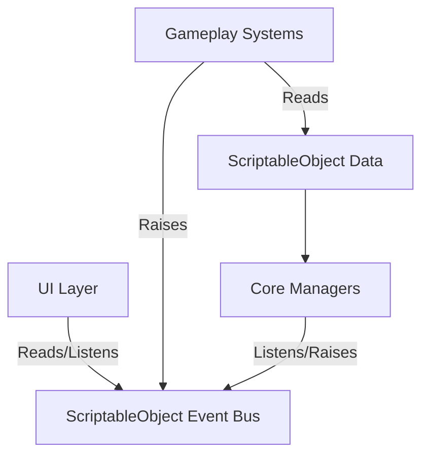

# 🏗️ Stray Swarm: Technical Architecture Blueprint

> [!IMPORTANT]
> This document serves as the foundational engineering blueprint for **Stray Swarm**. It defines the architectural patterns, system interactions, and data structures required to build the game in Unity 6 using the 2D Universal Render Pipeline (URP).

---

## 1. 📐 Architecture Overview

Stray Swarm is built upon a **Modular, Event-Driven, and Data-Driven** architecture.

- **Modular**: Systems are decoupled. The `GridManager` doesn't need to know about the `TailManager`. They communicate through interfaces and events.
- **Event-Driven**: We use a ScriptableObject-based event architecture (often referred to as the Ryan Hipple architecture). This prevents hard dependencies between managers. For example, when an animal is collected, it raises an `AnimalCollectedEvent` rather than directly calling the UI and Score managers.
- **Data-Driven**: Game design parameters (levels, animal types, game settings) are stored in ScriptableObjects. This allows designers to tweak the game without touching code.



---

## 2. ⚙️ Unity Project Setup

- **Engine Version**: Unity 6 (6000.0.x or latest stable)
- **Render Pipeline**: Universal Render Pipeline (URP) - 2D Renderer
- **Target Platforms**: Mobile (iOS & Android)
- **Target Resolution**: 1080 x 1920 (9:16 Portrait orientation)
- **UI Canvas Scaler**: Scale With Screen Size (Reference: 1080x1920, Match Width Or Height: 0.5)
- **Target Frame Rate**: 60 FPS (Set via `Application.targetFrameRate = 60;`)
- **Physics**: 2D Physics engine (though primarily used for triggers, not rigid body simulations)
- **Color Space**: Linear
- **Input System**: New Input System (com.unity.inputsystem) — REQUIRED
- **Async Support**: Unity 6 native Awaitable class for async/await

---

## 3. 📂 Folder Structure

The project strictly follows a convention-based folder structure to ensure maintainability. All game-specific assets reside inside `Assets/_StraySwarm/` to separate them from third-party plugins.

```text
Assets/
├── Plugins/                 # Third-party tools (e.g., DOTween)
├── Settings/                # URP Assets, Project Settings overrides
└── _StraySwarm/
    ├── Animations/          # Animation Clips and Animator Controllers
    ├── Art/
    │   ├── Characters/      # Stray cat, animals
    │   ├── Environment/     # Grid tiles, props, rescue station, vans
    │   └── UI/              # Buttons, icons, panels
    ├── Audio/               # SFX and BGM (.ogg)
    ├── Data/                # ScriptableObject instances
    │   ├── Events/          # GameEvent SOs
    │   ├── Levels/          # LevelData SOs
    │   └── Settings/        # GameSettings SO
    ├── Materials/           # URP 2D Materials (if any custom shaders are used)
    ├── Prefabs/
    │   ├── Characters/      # Player, Followers
    │   ├── Core/            # GameManager, EventSystem
    │   ├── Environment/     # Vans, RescueStation
    │   └── UI/              # Screens, HUD
    ├── Scenes/              # Boot, MainMenu, Gameplay, LevelSelect
    └── Scripts/
        ├── Core/            # Singletons, Game state logic
        ├── Data/            # ScriptableObject class definitions
        ├── Events/          # SO Event architecture scripts
        ├── Gameplay/        # Player, Tail, Grid, Vans
        ├── UI/              # Menus, HUD controllers
        └── Utils/           # Helpers, Extensions
```

---

## 4. 🎬 Scene Architecture

We use a multi-scene architecture to manage memory and separation of concerns.

| Scene | Responsibilities |
| :--- | :--- |
| **0_Boot** | Initializes core persistent systems (AudioService, SaveSystem). Loads the next scene immediately. Never unloaded. |
| **1_MainMenu** | Title screen, settings, link to level select. |
| **2_LevelSelect** | Grid or list of available levels, reading from SaveSystem for star ratings and unlock status. |
| **3_Gameplay** | The actual game loop. Contains the Grid, Player, UI HUD, and specific Level logic. |

> [!TIP]
> The Boot scene should contain a `DontDestroyOnLoad` object that holds essential services that persist across the entire app session.

---

## 5. 🧩 Core Systems

### 5.1 GameManager
**Responsibilities**: Manages the high-level state of the game loop (Start, Playing, Paused, GameOver, LevelComplete).
**Type**: Singleton (or Monobehavior accessed via Service Locator)
```csharp
public enum GameState { Init, Playing, Paused, LevelComplete, GameOver }

public class GameManager : MonoBehaviour {
    public static GameManager Instance { get; private set; }
    public GameState CurrentState { get; private set; }
    
    // Public API
    public void StartLevel(LevelData level);
    public void PauseGame();
    public void ResumeGame();
    public void EndLevel(bool success, int stars);
}
```

### 5.2 GridManager
**Responsibilities**: Defines the playable area, handles pathfinding validation, and node lookups.
**Type**: MonoBehaviour
```csharp
public class GridManager : MonoBehaviour {
    private Dictionary<Vector2Int, NodeData> gridGraph;
    
    // Public API
    public void GenerateGrid(LevelData data);
    public NodeData GetNodeAt(Vector2Int position);
    public bool IsValidMove(Vector2Int currentPos, Vector2Int direction);
    public Vector3 GetWorldPosition(Vector2Int gridPos);
}
```

### 5.3 NodeData
**Responsibilities**: Represents a single intersection or grid point.
**Type**: Plain C# Class / Struct
```csharp
public class NodeData {
    public Vector2Int GridPosition;
    public Vector3 WorldPosition;
    public List<Vector2Int> ValidDirections; // e.g., Up, Down, Left, Right
    public IGridOccupant CurrentOccupant; // Interface for Animals, Obstacles
}
```

### 5.4 InputHandler
**Responsibilities**: Detects screen swipes, calculates direction, implements input buffering and dead zones. Note: The old `Input` class (e.g., `Input.GetKey`, `Input.GetAxis`) is DEPRECATED in Unity 6. We MUST use `UnityEngine.InputSystem`.
**Type**: MonoBehaviour
```csharp
using UnityEngine.InputSystem;

public class InputHandler : MonoBehaviour {
    [SerializeField] private InputAction swipeAction; // Bind to touch/pointer drag
    [SerializeField] private float swipeThreshold = 50f;
    [SerializeField] private float inputBufferTime = 0.5f;
    
    private void OnEnable() => swipeAction.Enable();
    private void OnDisable() => swipeAction.Disable();
    
    // Public API
    public Vector2Int GetBufferedInput();
    public void ConsumeInput();
    // Fires event: OnSwipeDetected(Vector2Int direction)
}
```

### 5.5 PlayerController
**Responsibilities**: Moves the player cat from node to node, handles continuous movement, consumes buffered inputs at intersections.
**Type**: MonoBehaviour
```csharp
public class PlayerController : MonoBehaviour {
    private Vector2Int currentGridPos;
    private Vector2Int currentDirection;
    private float moveSpeed;
    
    // Dependencies
    private GridManager grid;
    private InputHandler input;
    
    private void Update() {
        // Handle Lerp from node A to node B
        // Check for buffered input when approaching an intersection
    }
}
```

### 5.6 PathHistory
**Responsibilities**: Records the player's exact path to guide the tail.
**Type**: MonoBehaviour (attached to Player)
```csharp
public struct PathPoint {
    public Vector3 Position;
    public Quaternion Rotation;
    public float DistanceTraveled;
}

public class PathHistory : MonoBehaviour {
    private Queue<PathPoint> pathPoints;
    [SerializeField] private float recordInterval = 0.1f;
    
    public void RecordPoint();
    public PathPoint GetPointAtDistance(float distanceBehindHead);
}
```

### 5.7 TailManager
**Responsibilities**: Manages the conga line, gap closing, and sending animals to vans.
**Type**: MonoBehaviour
```csharp
public class TailManager : MonoBehaviour {
    private LinkedList<FollowerBehavior> tail = new LinkedList<FollowerBehavior>();
    [SerializeField] private float spacing = 1.0f;
    
    // Public API
    public void AddAnimal(FollowerBehavior animal);
    public void RemoveAnimal(FollowerBehavior animal);
    public bool TryDeliverToVan(AnimalColor requiredColor);
    private void CloseGaps();
}
```

### 5.8 FollowerBehavior
**Responsibilities**: Moves along the `PathHistory`, handles animations, and gap-closing dashes.
**Type**: MonoBehaviour
```csharp
public class FollowerBehavior : MonoBehaviour {
    public AnimalColor ColorType;
    private float currentDistanceBehindPlayer;
    private float targetDistanceBehindPlayer;
    
    private void Update() {
        // Lerp currentDistance to targetDistance for smooth gap closing
        // Fetch position from PathHistory based on currentDistance
    }
}
```

### 5.9 RescueStation & VanController & VanQueue
**Responsibilities**: Manages the delivery zone and the sequence of rescue vans.
```csharp
public class RescueStation : MonoBehaviour {
    // Triggers when player passes through
    private void OnTriggerEnter2D(Collider2D other) {
        if (other.CompareTag("Player")) {
            // Initiate delivery sequence based on current Van
        }
    }
}

public class VanController : MonoBehaviour {
    public AnimalColor RequiredColor;
    public int RequiredAmount;
    public int CurrentAmount;
    
    public bool ReceiveAnimal(AnimalColor color);
    public void Depart();
}

public class VanQueue : MonoBehaviour {
    private Queue<VanController> pendingVans;
    public void SpawnNextVan();
}
```

### 5.10 AnimalSpawner & ObjectPoolManager
**Responsibilities**: Spawns stray animals onto the grid using pooling.
```csharp
using UnityEngine.Pool;

public class ObjectPoolManager : MonoBehaviour {
    // Uses Unity 6's built-in ObjectPool
    private Dictionary<string, ObjectPool<GameObject>> pools;
    
    public GameObject Spawn(string poolTag, Vector3 position, Quaternion rotation);
    public void ReturnToPool(string poolTag, GameObject obj);
}

public class AnimalSpawner : MonoBehaviour {
    public void SpawnFromLevelData(LevelData data);
}
```

### 5.11 Async Operations (Awaitable)
**Responsibilities**: Handling non-timing-critical asynchronous logic (like loading, UI transitions) using Unity 6's native `Awaitable` async/await pattern as a modern alternative to coroutines.

---

## 6. 📡 ScriptableObject Event System

To keep systems decoupled, we use ScriptableObjects as event channels.

**Implementation**:
- `GameEvent`: A ScriptableObject with a list of listeners and a `Raise()` method.
- `GameEventListener`: A MonoBehaviour that subscribes to a `GameEvent` and invokes a `UnityEvent` when triggered.

**Key Events**:
- `Evt_LevelStart`
- `Evt_LevelComplete`
- `Evt_AnimalCollected` (Passes AnimalData)
- `Evt_ComboUpdated` (Passes combo int)
- `Evt_VanFilled`

> [!TIP]
> Use generic variants (e.g., `IntEvent`, `AnimalEvent`) to pass payloads with the events.

---

## 7. 🗄️ ScriptableObject Data

### LevelData
```csharp
[CreateAssetMenu(fileName = "Level_01", menuName = "StraySwarm/LevelData")]
public class LevelData : ScriptableObject {
    public int LevelID;
    public Vector2Int GridSize;
    public float TimeLimit;
    public List<Vector2Int> ObstaclePositions;
    public List<AnimalSpawnData> InitialAnimals;
    public List<VanData> VanSequence;
    
    [Header("Star Requirements")]
    public int OneStarScore;
    public int TwoStarScore;
    public int ThreeStarScore;
}
```

### AnimalData
```csharp
[CreateAssetMenu(fileName = "Animal_Dog", menuName = "StraySwarm/AnimalData")]
public class AnimalData : ScriptableObject {
    public AnimalColor Color;
    public Sprite SpriteNormal;
    public Sprite SpriteHappy;
    public RuntimeAnimatorController Animator;
    public int BaseScoreValue;
}
```

### GameSettings
```csharp
[CreateAssetMenu(fileName = "GlobalSettings", menuName = "StraySwarm/GameSettings")]
public class GameSettings : ScriptableObject {
    public float BasePlayerSpeed = 5f;
    public float SwipeBufferTime = 0.3f;
    public float GapCloseLerpSpeed = 10f;
}
```

---

## 8. 🎨 Rendering & Layering

Since it's a top-down 2D game, correct depth sorting is crucial.

**Dynamic Depth Sorting**:
- Use Unity's **Transparency Sort Mode** set to **Custom Axis** (Y = 1).
- As entities move up the screen (higher Y), they are rendered behind entities lower on the screen.
- Set `Transparency Sort Axis` in the Project Settings -> Graphics.

**Sorting Layers**:
1. `Background` (Grid, floor textures)
2. `Interactables` (Vans, Rescue Station base)
3. `Entities` (Player, Animals, Obstacles - use Dynamic Y Sorting here)
4. `Foreground` (Overhead bridges, trees)
5. `UI` (Canvas elements)

---

## 9. 💾 Save System

We will use JSON serialization writing to `Application.persistentDataPath` for progress. `PlayerPrefs` will only be used for simple settings (audio volume).

**SaveData Model**:
```csharp
[Serializable]
public class SaveData {
    public int HighestUnlockedLevel;
    public Dictionary<int, int> LevelStars; // LevelID -> Stars (1-3)
    public int TotalRescuedAnimals;
}
```

**SaveManager**:
- Serializes `SaveData` to JSON using `JsonUtility`.
- Loads on Boot. Saves asynchronously when a level is completed.

---

## 10. ⚡ Performance Guidelines

- **Object Pooling**: Mandatory for animals, floating text, and particle effects. `Instantiate` and `Destroy` should never be called during standard gameplay.
- **Sprite Atlasing**: Group all UI sprites into a single UI Atlas, and all gameplay sprites into a Gameplay Atlas to reduce draw calls.
- **Update vs FixedUpdate**: Use `Update` (with `Time.deltaTime`) for visual interpolation (Lerping). `FixedUpdate` is strictly for physics calculations (though minimal in this game).
- **Garbage Collection**: Avoid allocating memory in `Update` loops. Do not create new lists or arrays dynamically frame-by-frame. Pre-allocate arrays where possible.
- **Awaitable vs Coroutines**: Use `await Awaitable.WaitForSecondsAsync()` instead of coroutines for simple delays to avoid coroutine overhead.

---

## 11. 📝 Coding Standards

- **Naming Conventions**:
  - `PascalCase` for Classes, Methods, Properties.
  - `camelCase` for local variables and parameters.
  - `_camelCase` for private fields.
  - `UPPER_SNAKE_CASE` for constants.
- **Namespaces**: Wrap game logic in `namespace StraySwarm.Core`, `StraySwarm.Gameplay`, etc.
- **Comments**: Use XML documentation (`///`) for public APIs and classes. Keep inline comments brief, explaining *why* rather than *what*.
- **File Organization**: One class per file. File name must exactly match the class name.

---

## 12. 📦 Dependencies

- **Unity Universal Render Pipeline (URP)**: For 2D lighting and performance.
- **2D Sprite Package**: Core 2D utilities.
- **TextMeshPro**: BUILT INTO `com.unity.ugui` in Unity 6 (no separate package needed).
- **DOTween (Pro/Free)**: The backbone of all code-driven animations (UI popups, animal bouncing, van driving off).
- **Input System (New)**: (REQUIRED - old Input Manager is deprecated) for handling cross-platform inputs cleanly.
- **Cinemachine v3 (`com.unity.cinemachine`)**: Note that `CinemachineVirtualCamera` is now `CinemachineCamera`.
- **UnityEngine.Pool**: Built-in object pooling.

---

## 13. 🚀 Build Pipeline

### Android
- **Scripting Backend**: IL2CPP
- **API Level**: Minimum Android 7.0 (API 24), Target Latest.
- **Texture Compression**: ASTC
- **App Bundle**: Build `.aab` for Google Play Console.
- **Keystore**: Maintain a secure keystore file mapped in Project Settings -> Player -> Publishing Settings.

### iOS
- **Scripting Backend**: IL2CPP
- **Architecture**: ARM64
- **Target OS**: iOS 13.0+
- **Signing**: Automatically managed via Xcode / Apple Developer account.
- **Optimization**: Strip Engine Code enabled to reduce build size.
